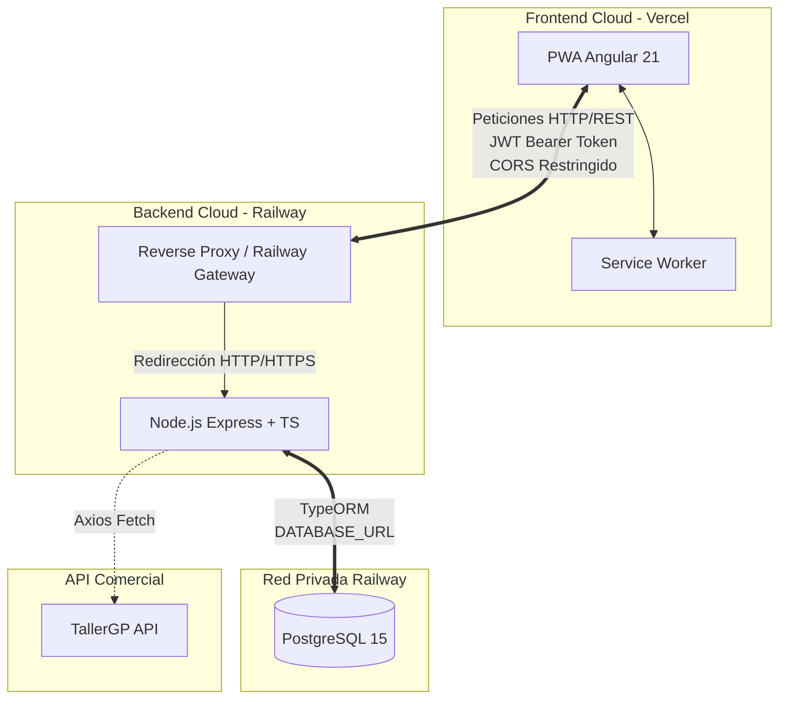

# 05. Diseño (modelo de datos, arquitectura y API)

## 5.1 Arquitectura General del Sistema
He diseñado Trazapiezas basándome en una arquitectura moderna, desacoplada y orientada a microservicios lógicos. La separación estricta entre el cliente y el servidor me permite escalar, mantener y desplegar cada entorno de forma independiente, cumpliendo con los estándares de la industria.

## 5.2 Patrón MVC y Lógica de Negocio
El entorno servidor (DWES) se ha estructurado siguiendo el patrón Modelo-Vista-Controlador (MVC), adaptado a una API REST:

- **Modelo (M):** Implementado mediante clases de TypeScript decoradas con TypeORM (src/entities/). Encapsulan la lógica de la base de datos (ej. @BeforeInsert para hashear contraseñas con bcrypt).

- **Controlador (C):** Funciones estáticas (src/controllers/) que reciben la petición, procesan la lógica de negocio (ej. validación de stock negativo en MovementController) y deciden qué devolver.

- **Vista (V):** Al ser una API, la vista son las respuestas estandarizadas en formato JSON emitidas al cliente.

## 5.3 Modelo de Datos Relacional (Diagrama ER)
El diseño de la base de datos es fuertemente relacional. He implementado claves primarias seriales y UUIDs, y claves foráneas (`ManyToOne`, `OneToMany`) para garantizar la integridad referencial de la trazabilidad.

TypeORM gestiona el esquema mediante `synchronize: true`, trasladando este modelo de clases a tablas de PostgreSQL.

erDiagram
  USER ||--o{ MOVEMENT : "registra"
  PART ||--o{ MOVEMENT : "genera historial"
  SHELF ||--o{ PART : "almacena"

  USER {
    int id PK
    string username "UNIQUE"
    string password "Hash Bcrypt"
    enum role "ADMIN | MECHANIC"
    boolean isActive
  }

  PART {
    int id PK
    string reference "UNIQUE"
    string brand
    string category
    text description
    decimal purchasePrice
    int stock
    boolean active "Baja lógica"
    uuid shelfId FK "Opcional"
  }

  SHELF {
    uuid id PK
    string name "UNIQUE"
    text description
  }

  MOVEMENT {
    int id PK
    int quantity
    enum status "STOCK | USED"
    string vehiclePlate "Índice búsqueda"
    string vin "Bastidor opcional"
    string engineCode "Motor opcional"
    datetime createdAt
    int partId FK
    int userId FK
  }

## 5.4 Diagrama de Casos de Uso
El control de acceso basado en roles (RBAC) define interacciones muy marcadas dependiendo de la autorización del usuario autenticado.

flowchart LR
    Admin([Administrador])
    Mec([Mecánico])

    subgraph Trazapiezas [Casos de Uso del Sistema]
        UC1(Gestionar Personal y Roles)
        UC2(CRUD Catálogo y Estanterías)
        UC3(Registrar Entrada de STOCK)
        UC4(Registrar Salida / Instalación)
        UC5(Consultar Trazabilidad por Matrícula)
        UC6(Exportar Auditoría a PDF)
        UC7(Imprimir QR Estantería)
    end

    Admin --> UC1
    Admin --> UC2
    Admin --> UC3
    Admin --> UC4
    Admin --> UC5
    Admin --> UC6
    Admin --> UC7

    Mec --> UC4
    Mec --> UC5
    Mec --> UC6

## Diseño de la API REST y Códigos HTTP
La API se ha diseñado bajo principios RESTful, utilizando sustantivos para los recursos y verbos HTTP para las acciones. La documentación interactiva se genera mediante OpenAPI 3.0 (`Swagger`), accesible en `/api-docs`.

El sistema implementa un middleware de control de errores (`errorMiddleware.ts`) que estandariza las respuestas, garantizando que el cliente reciba siempre un mensaje claro.

| Verbo | Ruta | Rol Mínimo | Payload / Query | Respuesta |
| :--- | :--- | :--- | :--- | :--- |
| **POST** | `/api/auth/login` | Público | `{ username, password }` | `200` + `{ token }` |
| **GET** | `/api/parts` | MECHANIC | `?category=...` | `200` + `Part[]` |
| **POST** | `/api/parts` | ADMIN | `Part (object)` | `201` + `Part` |
| **POST** | `/api/movements` | MECHANIC | `{ partId, quantity, status, plate }` | `201` / `400` |
| **GET** | `/api/movements/vehicle/:plate` | MECHANIC | Parámetro URL | `200` + `Movement[]` |

Se utiliza `403 Forbidden` para intentos de acceso por parte de `MECHANIC` a rutas `ADMIN`, y `401 Unauthorized` para fallos de sesión o tokens caducados.

## 5.6 Diagramas de Flujo de Procesos Principales

### Flujo A: Interceptación de Seguridad y Lógica de Stock
Este diagrama ilustra cómo el sistema protege la integridad del inventario mediante la validación de stock antes de persistir cualquier movimiento de tipo `USED`.

sequenceDiagram
    participant U as Frontend (Mecánico)
    participant API as Backend (Controller)
    participant DB as PostgreSQL

    U->>API: POST /api/movements (Token JWT)
    API->>API: Middleware: checkToken()
    API->>DB: Busca stock actual (partId)
    DB-->>API: Retorna { stock: 2 }
    
    alt stock < cantidad solicitada
        API-->>U: HTTP 400 "Stock Insuficiente"
    else stock >= cantidad solicitada
        API->>DB: Guarda Movement {status: USED}
        API->>DB: Actualiza Part {stock: stock - qty}
        API-->>U: HTTP 201 "Movimiento registrado"
    end

### Flujo B: Trazabilidad y Exportación de Histórico
Este flujo describe la recuperación del histórico de reparaciones de un vehículo para su posterior procesamiento documental en el cliente.

sequenceDiagram
    participant U as Usuario
    participant FE as Frontend (Angular)
    participant BE as Backend (API)

    U->>FE: Buscar matrícula (ej: 1234ABC)
    FE->>BE: GET /api/movements/vehicle/1234ABC
    BE-->>FE: Array de movimientos (JSON)
    FE->>FE: Generar vista con tabla de datos
    U->>FE: Click en "Exportar a PDF"
    FE->>FE: jsPDF renderiza informe de trazabilidad
    FE-->>U: Descarga de archivo .pdf