# 09. Manual de Usuario: Trazapiezas

## 9.1 Acceso y Conceptos Básicos
Trazapiezas es una herramienta *Mobile First* diseñada para ser utilizada en el entorno de taller.

### Inicio de Sesión
1. **Acceso**: Abre la URL de producción en tu navegador móvil.
2. **Identificación**: Introduce tu nombre de usuario y contraseña.
3. **Estado de cuenta**: Si el administrador ha desactivado tu cuenta (`isActive=false`), el sistema impedirá el acceso por seguridad.
4. **Persistencia**: La sesión se mantiene activa mediante un token JWT seguro guardado en el navegador, evitando tener que loguearte en cada visita.

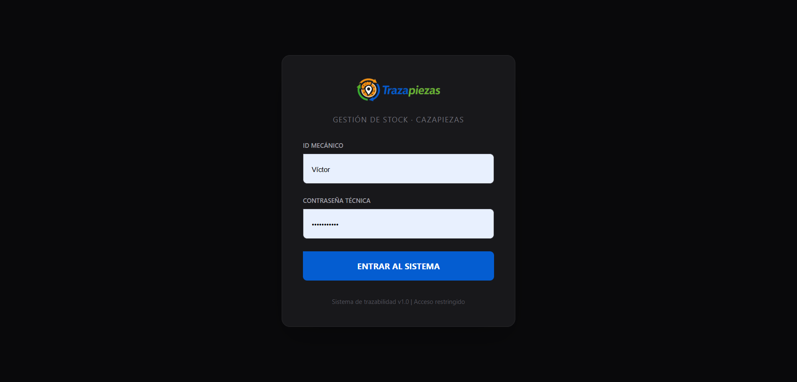  
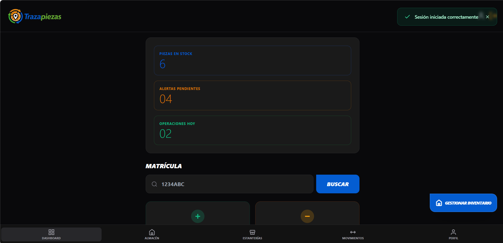

### Navegación
* **Barra Superior**: Acceso rápido al perfil y cierre de sesión seguro.
* **Menú Inferior**: Tu centro de mando. Permite navegar entre Dashboard, Almacén (Inventario), Estanterías, Movimientos e Historial.

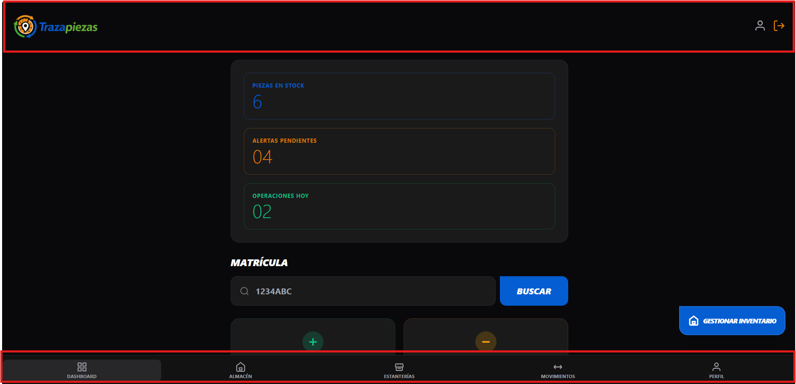  

## 9.2 Perfiles y Permisos (Seguridad)
La aplicación aplica un modelo **RBAC** (Control de acceso basado en roles) para proteger los datos críticos:
* **Administrador (ADMIN)**: Control total. Puede gestionar el catálogo, dar de alta/baja a personal y realizar ajustes de stock.
* **Mecánico (MECHANIC)**: Perfil operativo. Limitado a consultar inventario, registrar salidas (instalación) y consultar trazabilidad.

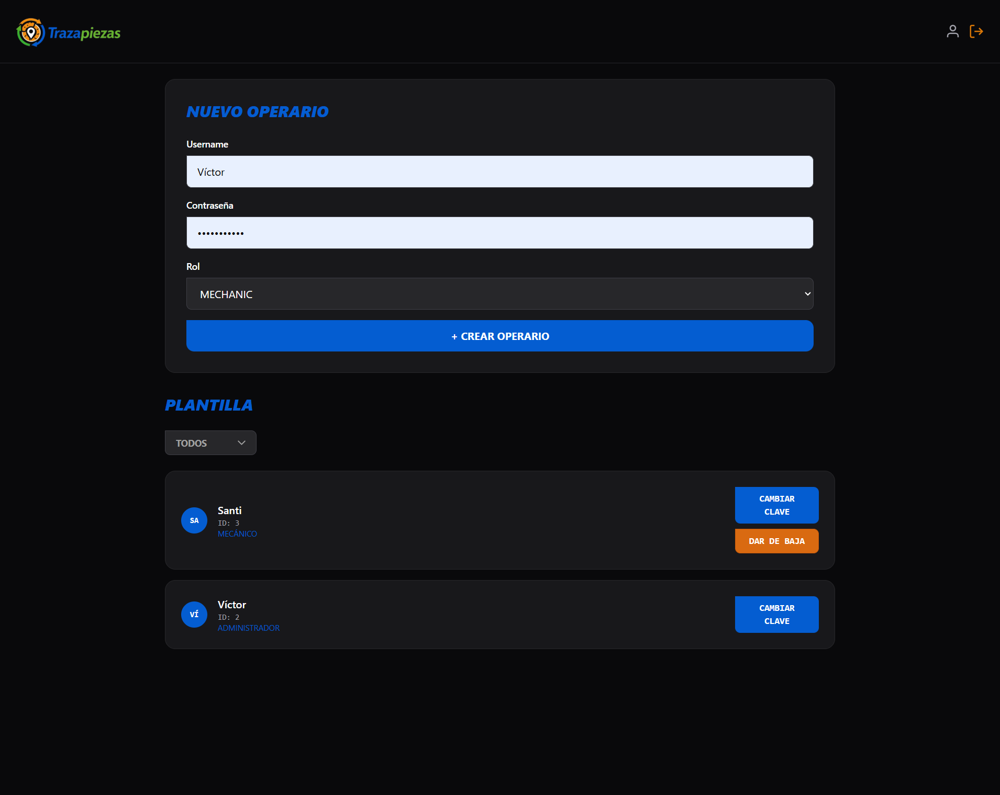
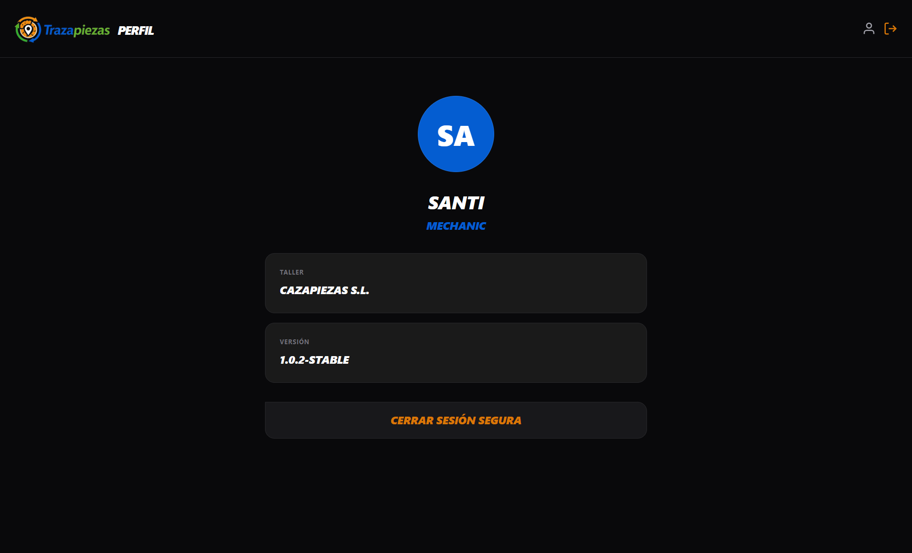

## 9.3 Operativa Diaria

### A) Instalar pieza en vehículo (Registro de salida `USED`)
1. Ve a **Almacén**.
2. Busca la pieza (puedes filtrar por marca o referencia).
3. Pulsa **"INSTALAR EN COCHE"**.
4. Introduce la **matrícula** del vehículo.
5. El sistema validará automáticamente si el vehículo existe o requiere alta rápida.
6. Ajusta la cantidad y confirma. El stock se descontará en tiempo real.

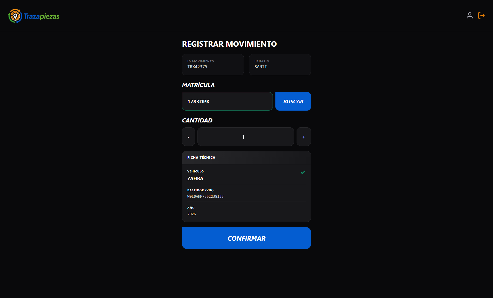

### B) Registro de Albarán (Entrada de stock `STOCK`)
1. Solo disponible para perfiles **ADMIN**.
2. Ve a **Almacén** y activa el modo de entrada de stock.
3. Busca la pieza, pulsa **"ENTRADA DE STOCK"**.
4. Confirma la cantidad recibida.

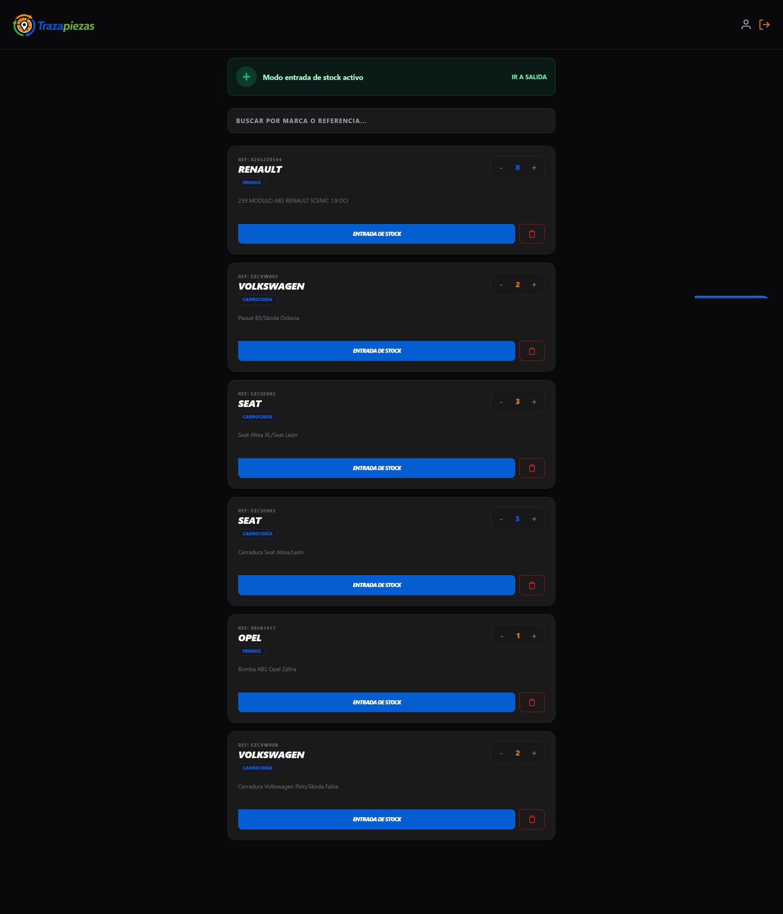
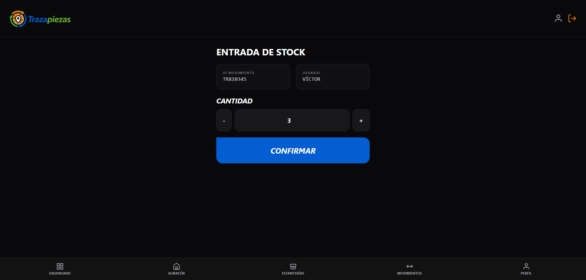

### C) Trazabilidad y Auditoría
1. Ve a **Movimientos** (Histórico).
2. Introduce la matrícula del vehículo.
3. Visualiza el histórico de reparaciones.
4. Pulsa **"Exportar PDF"** para obtener el justificante técnico de las piezas instaladas.

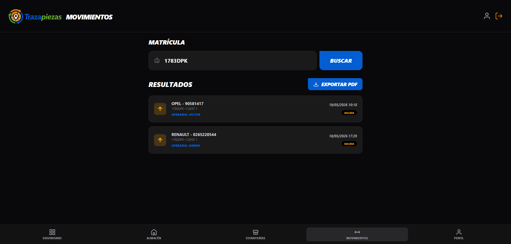  
[Ver PDF exportado por historial de matrícula](./trazabilidad_1783dpk_2026-05-20.pdf)

## 9.4 Gestión de Almacén (Estanterías)
El sistema permite organizar el taller físicamente:
1. **Creación**: Los usuarios **ADMIN** pueden crear nuevas estanterías con descripción.
2. **QR Inteligente**: Genera un código QR para cada estantería. Al escanearlo, el sistema redirige automáticamente al listado de piezas de esa ubicación, acelerando la localización del recambio.

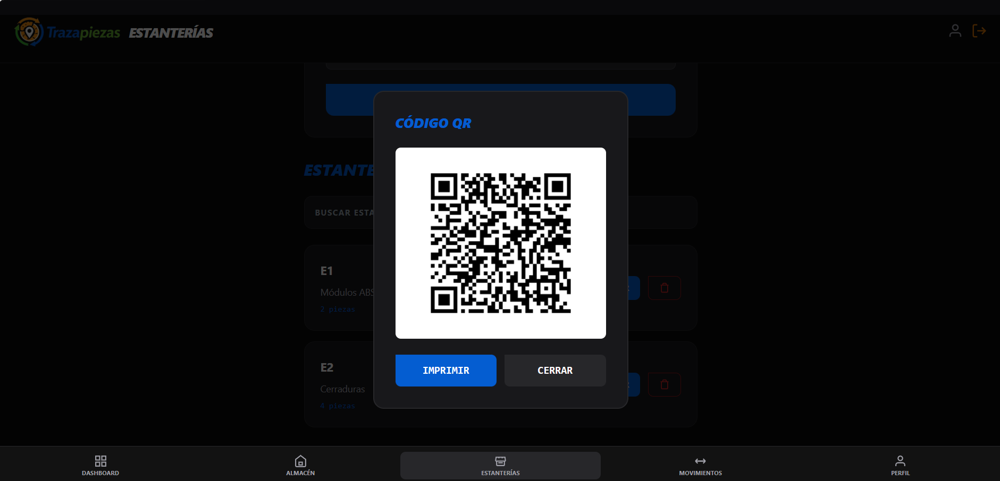

## 9.5 Gestión de Personal (ADMIN)
Desde el panel de **Personal**:
* **Alta/Baja**: Puedes alternar el estado `isActive` para suspender o activar operarios sin borrar sus registros históricos.
* **Seguridad**: Capacidad de resetear contraseñas de cualquier operario.

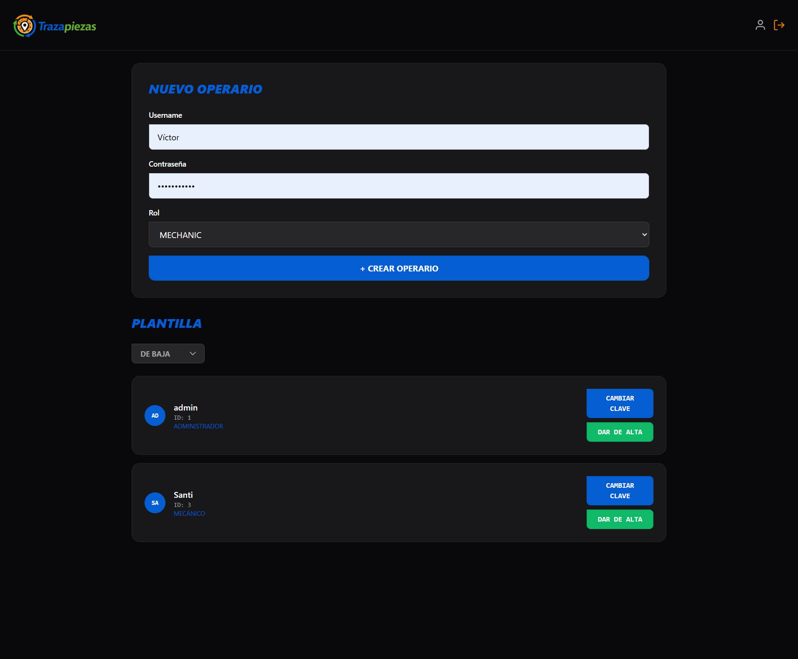  
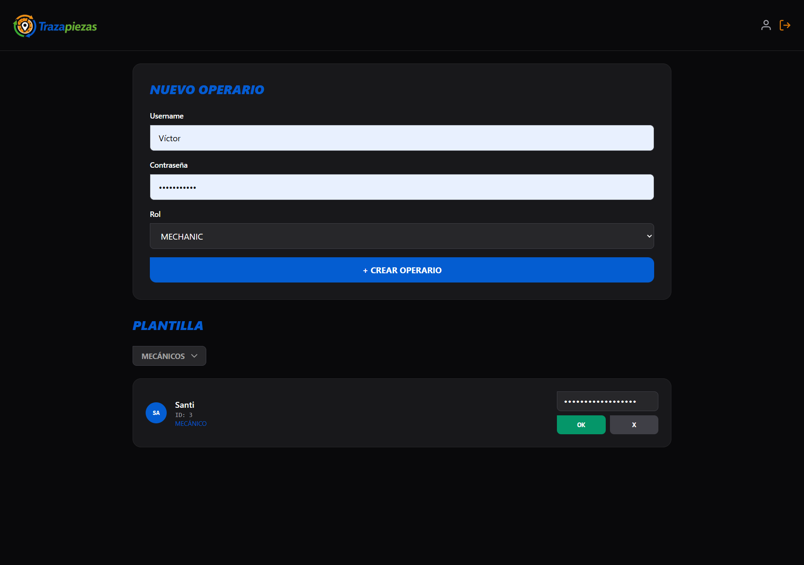

## 9.6 Instalación PWA (Modo Nativo)
Para mejorar la experiencia:
1. Abre la URL en Chrome o Edge (Android/iOS).
2. En el menú del navegador, selecciona **"Instalar aplicación"** o **"Añadir a pantalla de inicio"**.
3. La aplicación se comportará como una app nativa, cargando los recursos estáticos desde la caché (*Service Worker*) para un acceso inmediato.

## 9.7 Resolución de problemas comunes
* **No puedo entrar**: Revisa que tu usuario esté marcado como activo y que la contraseña sea correcta.
* **La app parece "congelada"**: Si estás en un taller con mala cobertura, recarga la página. El Service Worker ya tiene la interfaz cargada para ti.
* **El PDF no descarga**: Asegúrate de que el navegador tiene permisos de descarga habilitados y que has filtrado al menos una matrícula válida.